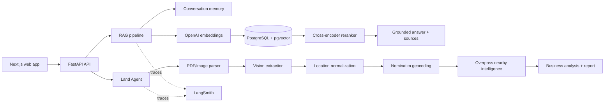

# Sri Lanka Business Intelligence Copilot

An AI decision-support application for entrepreneurs and investors in Sri Lanka. It combines a cited multi-source RAG assistant with multimodal land-plan understanding, geospatial enrichment, business analysis, conversation memory, evaluation, and LangSmith observability.

## What it does

- Answers business questions using retrieved Sri Lankan and international source documents.
- Reranks vector-search candidates with a cross encoder and returns document metadata and citations.
- Accepts PDF, PNG, and JPEG land documents, extracts visible evidence with a vision model, normalizes and geocodes locations, finds nearby infrastructure, and produces a structured business report.
- Preserves question history through conversation IDs.
- Compares vector-only retrieval with the production vector-plus-reranker pipeline over 30 RAG questions; six additional Land Intelligence tasks cover multimodal behavior.
- Captures complete RAG and Land Intelligence traces in LangSmith.
- Exposes a model-directed `/agent` route that selects knowledge search or business advice, explains the choice, and carries conversation memory across turns.
- Supports optional answer grading for groundedness, relevance, citation quality, and unsupported claims.

## Architecture



More detail: [Architecture](docs/ARCHITECTURE.md), [Evaluation](docs/EVALUATION.md), and [Demo guide](docs/DEMO.md).

## Data sources

The ingestion catalogue supports the Central Bank of Sri Lanka, Board of Investment, Department of Census and Statistics, Export Development Board, Department of Agriculture, Sri Lanka Customs, Inland Revenue Department, university research, World Bank, FAO, and IMF material. Land enrichment uses OpenStreetMap Nominatim and Overpass. Actual answer coverage depends on which configured documents have been crawled and ingested into the local database.

Document metadata includes publisher/source, title, filename, category, type, publication date, and URL. The application surfaces these fields with generated answers and uses them in evaluation.

## Local setup

Prerequisites: Python 3.11+, Node.js 20+, PostgreSQL with pgvector, and OpenAI credentials.

```bash
cd backend
python -m venv .venv
source .venv/bin/activate
pip install -r requirements.txt
cp .env.example .env  # if provided; otherwise create .env from app/core/settings.py
python scripts/create_tables.py
python scripts/ingest_sources.py
uvicorn app.main:app --reload
```

In a second terminal:

```bash
cd frontend
npm ci
npm run dev
```

Open `http://localhost:3000`. The backend API and interactive API documentation are normally available at `http://localhost:8000` and `http://localhost:8000/docs`.

Required backend settings are defined in `backend/app/core/settings.py`. At minimum configure the database URL and OpenAI API key. For tracing, set the LangSmith variables described below.

## Evaluation

Run fast deterministic tests:

```bash
cd backend
pytest -q
```

Run the live retrieval benchmark (requires the populated database and embedding/model access):

```bash
python -m app.evaluation.run_evaluation
```

Add `--include-answers` only when answer samples are needed; it makes one extra LLM request per question. Outputs are written to `app/evaluation/reports/evaluation_results.json` and `evaluation_summary.md`.

Run the full answer-quality rubric only for a deliberate final evaluation because it makes two model calls per task:

```bash
python -m app.evaluation.run_evaluation --grade-answers
```

The verified 30-answer run scored 4.533/5 mean groundedness, 4.667/5 relevance, and 4.667/5 citation quality. Thirteen answers contained at least one flagged unsupported claim. The detailed report is in `backend/app/evaluation/reports/evaluation_summary.md`; LLM-judge results must be manually spot-checked before presentation.

The report includes Hit@3, mean reciprocal rank, Precision@3, per-category results, and explicit expected-source failures for both vector-only and reranked retrieval. These are retrieval metrics, not claims of factual-answer correctness.

## LangSmith observability

Configure `LANGSMITH_TRACING=true`, `LANGSMITH_API_KEY`, `LANGSMITH_PROJECT`, and optionally `LANGSMITH_ENDPOINT`. A Land Intelligence request creates one parent trace with child runs for:

`parser → vision extraction → location normalization → geolocation → nearby OpenStreetMap intelligence → business analysis → report building`

Inputs, outputs, latency, errors, and fallback behavior can therefore be explained step by step without changing the API response.

The model-directed route adds `Business Copilot Agent → Choose Agent Tool → knowledge_search | business_advisor`. Call `POST /agent` with a question, optional `conversation_id`, and optional structured `land_report`; the response exposes `selected_tool` and `routing_reason`.

A verified live routed-agent run, including its shared LangSmith link and identifiers, is documented in `docs/TRACE_EVIDENCE.md`.

## Submission document

The concise three-page project brief is stored at `docs/Sri_Lanka_Business_Intelligence_Copilot_Project_Document.docx`.

## Known limitations

- Retrieval quality depends on corpus completeness and metadata quality.
- Geocoding can resolve only a broad administrative area; confidence and location level must be reviewed before making a property decision.
- OpenStreetMap coverage varies and nearby distances are straight-line estimates.
- Vision extraction from low-quality scans can be incomplete.
- Outputs support research and screening; legal, tax, valuation, survey, and investment decisions require qualified professional verification.

## Demo

Use one cited RAG question, one follow-up that demonstrates memory, and one clear land-plan upload. Then open the corresponding LangSmith trace and the generated evaluation summary. See [docs/DEMO.md](docs/DEMO.md) for a presentation-ready sequence.
